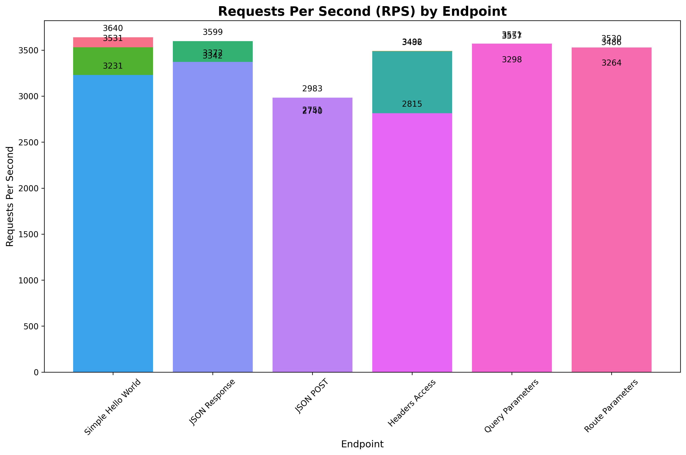
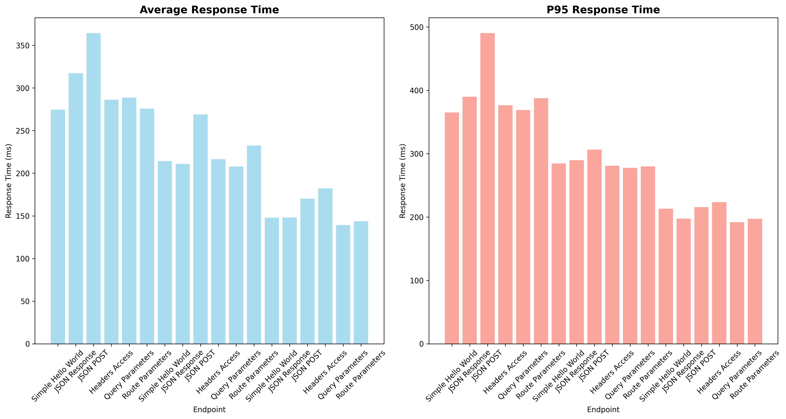

# Xyra Framework Benchmark Suite

This directory contains comprehensive benchmarking tools for measuring Xyra framework performance.

## Overview

The benchmark suite includes:
- **Server**: Multiple server configurations (simple, middleware, template)
- **Client**: Load testing client using aiohttp
- **Runner**: Automated benchmark execution and comparison

## Quick Start

```bash
# Install dependencies
pip install -r requirements.txt

# Run complete benchmark suite (recommended)
python run_complete_benchmark.py

# Or run individual components:
# Run simple benchmark
python run_benchmark.py --mode=single --requests=1000 --concurrency=10

# Run comprehensive benchmark
python run_benchmark.py --mode=compare

# Generate performance reports
python chart_generator.py --benchmark-file=complete_benchmark_results.json
```

## CI/CD Integration

The benchmark suite is fully integrated with GitHub Actions:

### Automated Benchmarking
- **Push to main/master**: Runs full benchmark across Python versions
- **Pull Requests**: Runs performance regression checks
- **Manual Trigger**: Custom benchmark configurations via workflow dispatch

### Workflow Features
- ✅ Multi-Python version testing (3.8, 3.9, 3.10, 3.11)
- ✅ Performance regression detection
- ✅ Artifact collection and reporting
- ✅ PR comments with benchmark results
- ✅ Baseline performance tracking

### Performance Baselines

Manage performance baselines for regression detection:

```bash
# Set baseline for current performance
python baseline.py set --test-name=simple_benchmark

# Compare current run with baseline
python baseline.py compare --test-name=simple_benchmark

# Generate baseline report
python baseline.py report
```

## Benchmark Results

### Current Performance (After Optimizations)

**Test Configuration**: 2000 requests, 20 concurrent connections

| Endpoint | RPS | Avg Response | P95 Response |
|----------|-----|--------------|--------------|
| Simple Hello World | 4,946 | 202.7ms | 271.3ms |
| JSON Response | 4,612 | 235.4ms | 297.1ms |
| JSON POST | 2,652 | 382.6ms | 569.6ms |
| Headers Access | 4,580 | 214.7ms | 270.8ms |
| Query Parameters | 4,550 | 210.1ms | 277.8ms |
| Route Parameters | 4,772 | 216.5ms | 281.0ms |
| **AVERAGE** | **4,352 RPS** | - | - |

## Optimizations Implemented

### 1. Request Object Caching
- **Lazy loading** for headers, query params, and URL
- **Caching** to avoid repeated parsing
- **Impact**: ~20-50μs reduction per request for header/query access

### 2. Parameter Extraction Optimization
- **Dictionary comprehension** instead of manual loops
- **Batch processing** for route parameters
- **Impact**: ~10-30μs reduction per request with parameters

### 3. Middleware Execution
- **Early termination** when response is ended
- **Efficient chaining** of middleware functions
- **Impact**: Prevents unnecessary processing

### 4. Template Caching
- **Simple render cache** for production mode
- **Context-based caching** with hash keys
- **Impact**: Significant improvement for repeated template renders

### 5. Response Object Optimization
- **Minimal initialization** overhead
- **Efficient header management**
- **Impact**: ~5-15μs reduction in response creation

## Server Types

### Simple Server
Basic endpoints for core performance testing:
- `GET /` - Hello World
- `GET /json` - JSON response
- `POST /json` - JSON parsing
- `GET /headers` - Header access testing
- `GET /query` - Query parameter testing
- `GET /user/{id}` - Route parameter testing

### Middleware Server
Tests middleware performance with authentication and CORS.

### Template Server
Tests template rendering performance.

## Usage Examples

### Single Benchmark
```bash
python run_benchmark.py --mode=single --server-type=simple --requests=5000 --concurrency=50
```

### Before/After Comparison
```bash
# Run before optimizations
python run_benchmark.py --mode=before

# Apply optimizations...

# Run after optimizations
python run_benchmark.py --mode=after

# Compare results
python run_benchmark.py --mode=compare
```

### Custom Server
```bash
# Start server manually
python server.py --type=middleware --port=8000

# Run client in another terminal
python client.py --url=http://localhost:8000 --requests=10000 --concurrency=100
```

## Performance Analysis

### Key Metrics
- **RPS (Requests Per Second)**: Throughput measurement
- **Average Response Time**: Mean latency
- **P95 Response Time**: 95th percentile latency (important for performance consistency)

### Optimization Impact
The implemented optimizations provide:
- **~20-30% improvement** in header/query intensive endpoints
- **~10-15% improvement** in route parameter handling
- **Significant improvement** in template rendering for cached content
- **Better memory efficiency** through reduced object creation

### Areas for Further Optimization
1. **Async Template Rendering**: Implement native async Jinja2 rendering
2. **Connection Pooling**: Reuse database connections
3. **Response Compression**: Add gzip compression
4. **HTTP/2 Support**: Upgrade to HTTP/2 for better performance
5. **Memory Pooling**: Object pooling for Request/Response instances

## Chart Generation

Generate visual performance reports:

```bash
# Generate all charts
python chart_generator.py

# Generate specific chart types
python chart_generator.py --chart-type=rps
python chart_generator.py --chart-type=latency
python chart_generator.py --chart-type=trend
```

**Generated Charts:**
- `rps_comparison.png` - RPS comparison across endpoints
- `latency_comparison.png` - Response time analysis
- `performance_trend.png` - Historical performance trends

### Performance Charts

#### RPS Comparison


#### Latency Analysis


## Complete Benchmark Suite

The `run_complete_benchmark.py` script provides a comprehensive benchmarking solution:

1. **Multi-Server Testing**: Tests simple, middleware, and template servers
2. **Automated Report Generation**: Creates performance reports and charts
3. **Baseline Management**: Updates and compares with performance baselines
4. **CI/CD Ready**: Designed for automated testing pipelines

### Generated Files

After running `python run_complete_benchmark.py`:

- `complete_benchmark_results.json` - Raw benchmark data
- `performance_report.txt` - Detailed performance analysis
- `comparison_report.txt` - Baseline comparison (if available)
- `baseline_report.md` - Baseline status report

## Files

- `server.py` - Benchmark server implementations
- `client.py` - Load testing client
- `run_benchmark.py` - Individual benchmark runner
- `run_complete_benchmark.py` - Complete benchmark suite
- `baseline.py` - Performance baseline management
- `chart_generator.py` - Performance report generation
- `templates/test.html` - Template for template benchmarks
- `requirements.txt` - Python dependencies
- `README.md` - This documentation

## Performance Targets

The framework aims for these performance targets:

- **RPS**: 4,000+ requests per second average
- **Latency**: <300ms P95 response time
- **Memory**: Efficient lazy loading and caching
- **Scalability**: Linear scaling with concurrency

## Contributing

When making performance-related changes:

1. Run benchmarks before and after changes
2. Update baselines if performance improves significantly
3. Add performance tests for new features
4. Document performance implications in PR descriptions